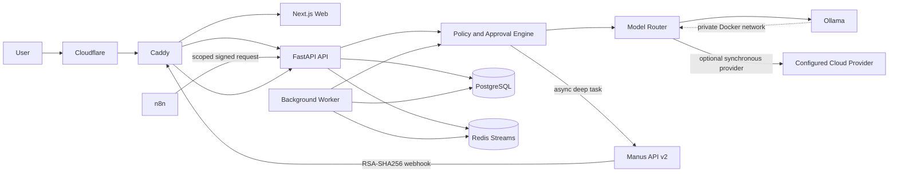

# NEXORA Multi-Model and Agent Architecture

**Status:** Approved design baseline
**Date:** 2026-08-01
**Scope:** NEXORA Intelligence on the existing VPS, `fablebd.com`, n8n, Ollama, and optional Manus API delegation

## 1. Executive decision

NEXORA must retain its own **policy-controlled orchestration brain** inside the existing API and worker. It must not hand unrestricted control of the VPS, database, browser, n8n, or secrets to any third-party agent runtime. Deterministic work remains deterministic code; evidence-grounded product analysis remains local by default; only tasks that genuinely require multi-step judgment are delegated to Manus.

| Layer | Approved responsibility | Explicitly prohibited responsibility |
| --- | --- | --- |
| NEXORA API and worker | Identity, policy resolution, task classification, model routing, budgets, approval gates, validation, persistence, and audit | Letting the browser or n8n choose arbitrary providers or models |
| Ollama | Private, low-cost chat, structured product insight, and embeddings | Internet-facing access or unrestricted tool execution |
| Manus API v2 | Asynchronous deep research, complex planning, long-horizon reasoning, and optional connector-assisted work | Pretending to be a synchronous chat model; direct database or VPS control; automatic confirmation of sensitive actions |
| n8n | Schedules, deterministic workflow steps, notifications, and calls to NEXORA's internal automation API | Storing provider secrets in workflow JSON; bypassing the router; invoking providers directly |
| OpenClaw | Optional future worker in a separately isolated profile after hardening and security review | Production brain, default deployment, host Docker socket, privileged container, public gateway, or unpinned `latest` image |
| Hermes Agent | Not approved for the current production baseline | Any current production execution until recent gateway and shell-execution advisories have an independently verified patched release |

This decision preserves the application's current evidence discipline, worker retry semantics, and idempotent automation while creating a clean path to multiple providers. It also prevents the common failure mode in which an autonomous runtime becomes both decision-maker and privileged executor.

## 2. Viable architecture options

The following are the viable implementation routes. The first route is the approved baseline because it extends the existing system with the smallest trust expansion. The other routes remain documented so the decision can be revisited deliberately.

| Approach | Tradeoffs | Recurring cost | Setup complexity |
| --- | --- | ---: | ---: |
| **NEXORA router + local Ollama + Manus only for selected async tasks** | Strong privacy, predictable operation, clean audit trail, and preserves existing code. Complex work has asynchronous latency and requires a Manus API credential. | Lowest by default; Manus usage only for escalated tasks | Medium |
| NEXORA router + several direct cloud-model providers | Fast access to many named models and synchronous fallbacks, but creates more secrets, billing surfaces, provider-specific behavior, and compliance work | Variable token charges across every enabled provider | High |
| OpenClaw as central agent gateway | Broad provider and channel support, but expands attack surface, has sandboxing that requires deliberate configuration, and creates a second orchestration authority | Infrastructure plus provider costs | High |
| Hermes Agent as central runtime | Capable agent framework and container controls, but recent primary advisories include high/critical gateway and shell-execution issues whose fixed-version mapping is not sufficiently clear for this baseline | Infrastructure plus provider costs | High and currently unacceptable |

The approved route does not prevent later expansion. It makes every new provider or autonomous runtime pass through the same data classification, budget, approval, and audit controls.

## 3. Existing-system facts that must remain true

The current implementation already has valuable safety properties. `apps/api/app/services/ai.py` sends evidence-only product facts to Ollama, requires a strict structured response, and distinguishes retryable provider failures from permanent contract failures. `apps/api/app/services/worker.py` persists jobs, maintains heartbeats, reclaims abandoned work, retries transient failures, and stores immutable AI insights.

| Existing invariant | Required treatment in the new design |
| --- | --- |
| Evidence is persisted before AI analysis | Preserve; no model may create a measured fact |
| Structured product insight is validated with Pydantic | Preserve for every provider adapter |
| Ollama is private on the Docker network | Preserve; never expose port `11434` publicly |
| n8n calls an internal automation endpoint | Preserve, while replacing the global key with scoped request authentication |
| Job retries apply only to transient failures | Preserve and make provider fallback separate from job retry |
| AI insight idempotency includes evidence, model, and prompt version | Upgrade to include policy version and a deterministic route signature |
| Browser chat streams from local Qwen | Preserve as the immediate default path |
| Caddy is the only public application ingress | Preserve; add only a narrowly scoped Manus callback route behind Caddy |

The current production overlay contains a tentative `openclaw` service with an unpinned `latest` image and insufficient hardening. That service must remain disabled and should be removed from the default production profile until a dedicated isolation profile is implemented.

## 4. Target topology

The router is a library inside the NEXORA API/worker at first, not a new network service. This avoids an unnecessary hop and keeps the existing transaction, job, and audit boundaries intact. A separate router service may be extracted later only if throughput or independent scaling requires it.

| Network zone | Components | Allowed ingress | Allowed egress |
| --- | --- | --- | --- |
| Public edge | Cloudflare and Caddy | `443/tcp` for `fablebd.com` and selected subdomains | Caddy to web/API; webhook route to API |
| Application network | Web, API, worker, n8n | Caddy to web/API; internal calls from n8n | Approved HTTPS providers; Redis/PostgreSQL; Ollama |
| Data network | PostgreSQL, Redis, Qdrant, MinIO | Application containers only | No general internet egress |
| Local model network | Ollama | API and worker only | Model download only during controlled maintenance |
| Optional agent sandbox | OpenClaw or another future runtime | NEXORA-signed internal jobs only | Explicit allowlisted destinations; no data-network access by default |

Only NEXORA can convert an external result into application state. A webhook result is untrusted input until its signature, timestamp, event identity, task binding, structured-output schema, and policy state have all been validated.

## 5. Task taxonomy and model policy

The browser, n8n, and callers submit a **task intent**, never an unrestricted provider/model name. The server maps that intent to a versioned policy. An administrator may later choose from an allowlisted registry, but normal users and workflow JSON cannot inject arbitrary endpoints or model identifiers.

| Task class | Default execution | Escalation path | External action permission |
| --- | --- | --- | --- |
| `price_insight` | Ollama `qwen3:8b`, strict JSON schema | One configured cloud workhorse only after local transient failure and data policy approval | None |
| `workspace_chat` | Ollama streaming | Optional stronger synchronous model for an explicit user request | Read-only application context |
| `embedding` | Ollama `qwen3-embedding:0.6b` | No automatic cloud fallback | None |
| `classification` | Deterministic rules first, then the cheapest approved model | Stronger model only on schema/quality-gate failure | None |
| `vision_extract` | Approved vision-capable provider when enabled | Second approved vision model | None |
| `deep_research` | Manus async task | Human review or a direct premium model if separately configured | Read-only connectors by default |
| `strategic_plan` | Manus async structured output | Human review | No execution without a separate approval |
| `external_action` | Deterministic code after approval | No autonomous fallback | Per-action approval mandatory |

A model registry entry describes capability and policy, not marketing availability. A model is shown as **active** only when its provider is configured, health-checked, allowlisted, and permitted for the current environment.

| Registry field | Purpose |
| --- | --- |
| `provider_id` and `model_id` | Stable execution identity |
| `capabilities` | Chat, structured output, vision, tools, embedding, streaming, context limit |
| `data_classes_allowed` | Maximum sensitivity the provider may receive |
| `task_classes_allowed` | Explicit tasks the model may execute |
| `unit_prices` and `currency` | Budget estimation and usage ledger |
| `max_input_tokens` and `max_output_tokens` | Hard request bounds |
| `enabled` and `health_state` | Operational availability |
| `config_version` | Reproducibility and rollback |

## 6. Data classification and egress policy

Every AI run receives a server-generated data class. Callers may request a stricter class but cannot downgrade it. Classification is based on the source, fields, tenancy, and requested tools.

| Data class | Examples | Allowed execution |
| --- | --- | --- |
| `PUBLIC` | Public product name, public URL, public price | Local or an approved cloud provider |
| `INTERNAL` | Aggregated metrics, non-secret workflow metadata | Local; cloud only when the policy explicitly allows it |
| `CONFIDENTIAL` | Customer records, private documents, unreleased business data | Local by default; cloud only with an explicit tenant/admin policy and redaction |
| `RESTRICTED` | Credentials, session tokens, private keys, raw authentication headers, payment secrets | Never sent to a model; redact or reject |

Prompt construction must use allowlisted fields. Secrets are blocked before request serialization. Raw n8n credentials, cookies, database URLs, internal IP addresses, environment files, and full webhook headers must never enter a model prompt.

## 7. Deterministic routing algorithm

Routing must be reproducible. The same validated input, policy version, data class, and provider health snapshot should produce the same candidate chain. Random provider selection is prohibited.

| Step | Required behavior | Failure outcome |
| ---: | --- | --- |
| 1 | Validate task schema, authenticated principal, scope, and idempotency key | Reject without provider call |
| 2 | Resolve server-side task policy and policy version | Reject if no active policy |
| 3 | Classify data and redact prohibited fields | Reject if safe transformation is impossible |
| 4 | Evaluate action risk and approval state | Persist `waiting_approval` when required |
| 5 | Check per-run, daily, and monthly budgets | Reject or route to a cheaper/local candidate |
| 6 | Build an ordered candidate list from enabled registry entries | Reject if no candidate satisfies policy |
| 7 | Execute one candidate and validate transport, schema, evidence, and quality gates | Continue only for an allowed fallback class |
| 8 | Persist attempt usage, latency, model version, output hash, and safe error | Never store secrets or unrestricted raw headers |
| 9 | Finalize the AI run and persist the domain result transactionally | Emit a correlated event |

The initial candidate policy is intentionally small: use local Ollama first for product insight and chat; use Manus only for task classes explicitly designated as asynchronous agent work; add one cloud workhorse provider only after a real VPS credential is provisioned and a spending cap is configured.

## 8. Fallback and retry semantics

Provider fallback and worker retry solve different problems. Fallback selects another eligible provider within one AI run. Worker retry schedules the entire job again after a transient run failure. Combining them without limits can multiply cost and duplicate external tasks.

| Failure class | Same-run fallback | Worker retry | Notes |
| --- | --- | --- | --- |
| Connection timeout, temporary network error | Yes, if an eligible candidate exists | Yes | Maximum two provider attempts per run |
| HTTP `408`, `429`, or `5xx` | Yes | Yes | Honor provider retry hints where available |
| Invalid credentials or disabled account | No | No | Operator alert; do not rotate blindly |
| Budget exceeded | No | No | Return a policy error or local-only route |
| Content-policy refusal | No automatic cross-provider bypass | No | Record safely and require review |
| Invalid structured output | One repair attempt on the same provider or one stronger allowed model | No repeated job retry | Prevents expensive loops |
| Input/policy/schema error | No | No | Permanent caller error |
| Manus task waiting for confirmation | No | No | Persist waiting state; require explicit human approval |
| Manus webhook delivery delay | No duplicate task creation | Reconcile by task ID | Webhook receipt and task creation must be idempotent |

A circuit breaker opens after repeated transient failures for one provider/model pair. While open, the router skips that candidate until the cool-down expires. Half-open probes are low-volume and never use confidential data.

## 9. Idempotency and route identity

The current insight key binds evidence to one Ollama model. The upgraded key must remain stable even when the router performs a transient fallback. It should identify the policy intent, not merely the final provider.

> `ai_run_key = SHA-256(task_class + subject_id + evidence_hash + prompt_version + policy_version + route_signature + normalized_parameters)`

| Identity | Meaning |
| --- | --- |
| `route_signature` | Hash of the ordered, policy-approved candidate identities and material routing parameters |
| `attempt_id` | Unique execution attempt under one AI run |
| `external_task_id` | Manus task ID or provider request ID, unique where supplied |
| `correlation_id` | Existing NEXORA job/request correlation ID propagated across events |
| `output_hash` | Integrity and duplicate-detection hash of the validated final result |

If a provider fallback succeeds, the resulting `AIInsight.model` records the actual provider/model identity while the run ledger retains the original route signature and all attempts.

## 10. Manus integration boundary

Manus is an **asynchronous delegated agent**, not another item in the synchronous chat fallback chain. NEXORA creates a Manus API v2 task only after the task class, data class, project, budget, and connector policy are resolved. The request uses a NEXORA-specific Manus Project for durable instructions and requests Structured Output for machine-consumed results.[1][2]

| Manus control | NEXORA rule |
| --- | --- |
| Authentication | First-party `x-manus-api-key` stored only in the VPS secret store |
| Project | One dedicated NEXORA project ID; no arbitrary user-supplied project ID |
| Agent profile | Server allowlist such as `lite`, `standard`, or `max`; selected by task policy and budget |
| Connectors | Empty by default; explicit connector IDs per task policy |
| Skills | Explicit allowlist; never inherit broad capabilities for high-risk tasks |
| Structured output | Required for application state changes; schema version stored with the run |
| Follow-up | Persist task ID and use message continuation only inside the bound run |
| Confirmation | Never auto-confirm email, publishing, deployment, purchase, deletion, or data disclosure |
| Result delivery | Signed webhook in production; reconciliation polling only for recovery |

Manus webhook requests are verified using RSA-SHA256. NEXORA must read the raw body, check `X-Webhook-Signature`, reject timestamps older than five minutes, reconstruct `{timestamp}.{url}.{sha256(body)}`, and verify using the cached Manus public key.[3] The exact externally visible webhook URL must be used during verification, including query parameters.

## 11. Approval model

Model output can recommend an action; it cannot grant permission to execute the action. Approval is a separate state machine bound to the exact action digest.

| Risk tier | Examples | Required approval |
| --- | --- | --- |
| `R0` read-only | Analyze persisted product evidence | None |
| `R1` reversible internal write | Save a draft or tag | Policy-authorized service action with audit |
| `R2` external communication | Send email/message, publish a post | Human confirmation for each action or narrow time-bound batch |
| `R3` financial, access, or destructive | Purchase, payment, credential change, production deploy, deletion | Explicit human confirmation; re-authentication; no agent auto-confirmation |

An approval stores `action_type`, canonical payload hash, target, requester, reason, expiry, status, and approver. Any payload mutation invalidates the approval. Approvals expire and cannot be reused across tasks.

## 12. Service authentication and n8n

The current single `X-Automation-Key` grants broad access. It should be replaced gradually with scoped service identities while retaining a compatibility window for the deployed workflows.

| Phase | Authentication behavior |
| --- | --- |
| Compatibility | Existing key accepted only for the current collection and AI schedule routes, with rate limits and audit logging |
| Hardened | `X-Nexora-Client`, timestamp, nonce, body hash, and HMAC signature; each client has scopes and rotated secret |
| Mature | Short-lived service JWT or mTLS for internal services; HMAC remains for simple webhook senders |

Recommended scopes include `automation:collect`, `automation:ai:local`, `automation:ai:delegated`, `approval:request`, and `webhook:manus:receive`. n8n receives only the scopes required by each workflow. The n8n payload may request a named policy such as `daily_price_insight`; it may not submit a provider base URL, secret, arbitrary model ID, or connector ID.

## 13. Budget and cost governance

No external provider becomes active without a budget. Cost checks occur before every attempt and are reconciled against actual usage afterward. Unknown pricing is treated as unavailable for unattended automation unless an administrator sets a conservative fixed estimate.

| Budget control | Initial policy |
| --- | --- |
| Per local insight | No provider charge; bounded token/context and timeout limits still apply |
| Per cloud call | Hard USD ceiling estimated from maximum allowed tokens |
| Per Manus task | Policy-specific profile and daily task limit |
| Per workflow run | Maximum products, maximum external calls, and maximum total estimated cost |
| Daily tenant total | Soft warning at 70%, hard stop at 100% |
| Monthly platform total | Soft warning at 70%, approval required at 90%, hard stop at 100% |

Cost and token data are operational metadata and must be visible in the admin interface. The system must not claim exact cost if a provider does not return usage or pricing is stale.

## 14. Persistence and audit schema

`AIInsight` remains the validated domain output. Routing and delegated-agent lifecycle require additive ledgers so that evidence is not overloaded with operational state.

| Table | Core fields |
| --- | --- |
| `ai_runs` | ID, job/request ID, task class, data class, policy/version, route signature, input hash, idempotency key, status, selected provider/model, output hash, estimated/actual cost, timestamps |
| `ai_attempts` | Run ID, sequence, provider/model, config version, status, latency, token usage, cost, provider request ID, safe error class/message, timestamps |
| `manus_delegations` | Run ID, task ID, project ID, agent profile, status, structured schema version, waiting reason, last event, timestamps |
| `webhook_receipts` | Provider, event identity/hash, timestamp, signature status, payload hash, processing status, retry count, received/processed timestamps |
| `approval_requests` | Run ID, action type, payload hash, risk tier, status, requester, approver, reason, expiry, timestamps |
| `provider_health` | Provider/model, state, failure count, circuit-open-until, last probe, config version |
| `usage_ledger` | Run/attempt, tenant, provider/model, input/output units, estimated/actual cost, currency, pricing version, timestamp |

Audit payloads contain references and hashes rather than secrets or full confidential prompts. Access is restricted to admins, and retention is defined separately from product evidence retention.

## 15. Configuration model

Secrets remain outside Git. Non-secret policy is versioned in the repository, reviewed, and deployed with the application. Environment variables enable providers but cannot silently broaden data or action permissions.

| Configuration type | Storage |
| --- | --- |
| Provider keys and webhook secrets | Docker secrets or root-readable production environment file as an interim step |
| Provider base URLs and model IDs | Validated environment settings or versioned registry without secrets |
| Task routing policy | Versioned YAML checked into `config/ai-routing-policy.v1.yaml` |
| Pricing snapshot | Versioned configuration with retrieval timestamp |
| Tenant overrides | Database, admin-only, bounded by platform policy |
| Manus public key cache | Memory/Redis with TTL; source endpoint authenticated with the Manus API key |

Production validation rejects placeholder secrets, disabled provider references, wildcard model IDs, unbounded token limits, cloud routes for restricted data, and any delegated action policy without an approval rule.

## 16. Domain and Cloudflare layout

`fablebd.com` should serve the premium customer-facing NEXORA workspace. The first deployment should minimize public endpoints and keep operator tooling private.

| Hostname | Purpose | Exposure |
| --- | --- | --- |
| `fablebd.com` | Main web application | Public through Cloudflare and Caddy |
| `www.fablebd.com` | Redirect to apex | Public through Cloudflare |
| `api.fablebd.com` | Optional future API hostname | Prefer same-origin `/api` initially |
| `hooks.fablebd.com` | Optional future webhook hostname | Only if operational separation is needed; rate-limited and signature-verified |
| n8n, Grafana, Prometheus, MinIO, Qdrant, Redis, PostgreSQL, Ollama | Internal/operator services | Never public DNS or public ports |

The required Cloudflare records are a proxied apex `A` record pointing to `46.250.242.20` and a proxied `www` CNAME pointing to `fablebd.com`. `NEXORA_HOST` then changes from the temporary sslip hostname to `fablebd.com`; after Caddy obtains a valid origin certificate, Cloudflare SSL/TLS is set to **Full (strict)**. DNS mutation and production cutover require an explicit confirmation and a rollback checkpoint.

## 17. OpenClaw and Hermes decision

OpenClaw has stronger documented provider selection, authentication-profile rotation, fallback ordering, and active release maintenance than Hermes for this use case.[4][5] However, its documentation states that sandboxing must be deliberately configured and that the gateway is a trust boundary.[6][7] It must therefore be treated as an optional isolated executor rather than NEXORA's brain.

| Criterion | OpenClaw | Hermes Agent | NEXORA decision |
| --- | --- | --- | --- |
| Provider abstraction and failover | Strong documented support | Provider support exists, but less appropriate than NEXORA's own policy ledger | NEXORA owns routing; OpenClaw optional later |
| Docker deployment | Official flow available | Official flow available | Neither receives host socket or privileged mode |
| Isolation default | Requires deliberate sandbox configuration | Container and command controls available, but defaults require review | Separate network, read-only root, non-root user, dropped capabilities, egress allowlist |
| Current security signal | Recent advisories exist, but active release cadence and current stable channel are visible | Recent high/critical advisories include gateway authorization and shell execution; fixed-version mapping is not clear enough | Hermes rejected for current production |
| Operational fit | Optional channel/tool worker | Not needed for current objectives | Existing NEXORA worker remains authoritative |

If OpenClaw is trialed later, the image must be pinned by immutable digest, all sandbox controls enabled, its gateway bound only to the internal network, secrets delivered through a dedicated secret store, filesystem read-only except dedicated volumes, capabilities dropped, `no-new-privileges` enabled, memory/CPU/PID limits enforced, and no access granted to Docker socket, PostgreSQL, Redis, MinIO, or the host filesystem.

## 18. Premium UI implications

The premium interface should visualize real system state rather than presenting a decorative model picker. Normal users choose outcomes and quality modes; administrators manage provider policy.

| Surface | Required visual behavior |
| --- | --- |
| Chat composer | `Local Private`, `Balanced`, and `Deep Research` modes mapped to server policies |
| AI run detail | Timeline of queued, routing, executing, validating, waiting approval, and completed states |
| Model registry | Active/configured/unavailable status, capabilities, health, last check, and data-class limit |
| Cost center | Daily/monthly usage, budget thresholds, local-vs-cloud savings, and unknown-cost warnings |
| Approval inbox | Exact action, target, payload digest, risk tier, expiry, and approve/reject controls |
| Automation view | n8n workflow, policy name, run ID, jobs, retries, dead letters, and correlated AI runs |
| Evidence panel | Measured facts clearly separated from generated interpretation |
| Security status | Webhook verification, provider circuit state, secret age, and configuration version |

The UI must never receive provider keys, full internal error traces, webhook verification material, raw confidential prompts, or unrestricted provider endpoints.

## 19. Acceptance criteria

The architecture is ready for production only when each control below has an automated or documented verification step.

| Area | Acceptance criterion |
| --- | --- |
| Backwards compatibility | Existing local chat, product insight, n8n schedule, job retry, and AI insight tests pass |
| Routing | Same input and policy generate a deterministic route signature |
| Security | Browser/n8n cannot select arbitrary endpoints, models, connectors, or secrets |
| Data egress | Restricted fields are rejected before serialization; cloud tests use synthetic data |
| Budget | A call that would exceed a hard budget is blocked before provider invocation |
| Fallback | Transient failure falls back once; permanent/policy errors do not cascade |
| Idempotency | Replayed jobs or webhooks do not create duplicate provider tasks or insights |
| Manus | Valid signed webhook succeeds; invalid signature, stale timestamp, unknown task, and duplicate event are rejected safely |
| Approval | Mutating an approved payload invalidates approval; sensitive actions cannot auto-confirm |
| Observability | Every run has correlation ID, policy version, route signature, attempt ledger, and safe outcome |
| Infrastructure | Only Caddy exposes public ports; internal services remain private |
| Rollback | Provider can be disabled and the system returns to Ollama-only operation without data migration rollback |

## 20. References

[1]: https://open.manus.ai/docs/v2/task.create "Manus API v2 task.create"
[2]: https://open.manus.ai/docs/v2/structured-output "Manus Structured Output"
[3]: https://open.manus.ai/docs/v2/webhooks-security "Manus Webhook Security"
[4]: https://docs.openclaw.ai/concepts/models "OpenClaw Models"
[5]: https://docs.openclaw.ai/concepts/model-failover "OpenClaw Model Failover"
[6]: https://docs.openclaw.ai/gateway/sandboxing "OpenClaw Sandboxing"
[7]: https://docs.openclaw.ai/install/docker "OpenClaw Docker Installation"
[8]: https://github.com/advisories/GHSA-9396-xwf6-94hp "Hermes Agent authorization bypass advisory"
[9]: https://github.com/advisories/GHSA-5p65-6hm5-c89p "Hermes Agent shell execution advisory"
[10]: https://github.com/advisories/GHSA-g8j6-2v57-f5wp "Hermes Agent file-tool symlink advisory"
